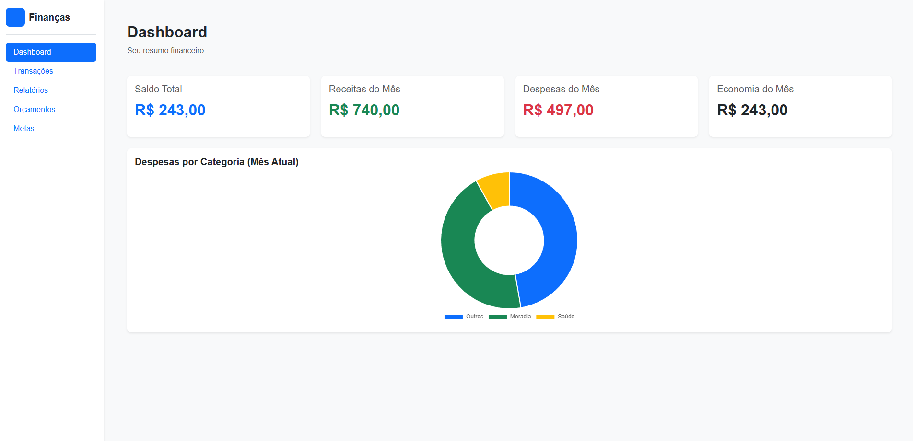
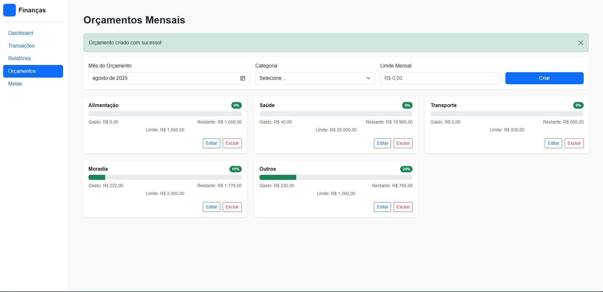

# Sistema de Gestão Financeira Pessoal 
Este é um projeto de uma aplicação web completa para **gestão financeira pessoal**, desenvolvida com um frontend em **React** e um backend em **Python**. A aplicação permite aos utilizadores controlar as suas finanças de forma detalhada e intuitiva.
 --- 
 ## 📸 Screenshots do Sistema 
 
 **Adicione aqui screenshots da sua aplicação para uma visualização rápida.** 
 
 - **Dashboard Principal** 
  
 
 - **Página de Transações** 
  
 
 - **Página de Orçamentos** 
  
 
 --- 
 ## ⚙️ Funcionalidades Implementadas 
 
 O sistema está organizado em várias páginas, cada uma com funcionalidades específicas para uma gestão financeira completa.
  ### 1. **Dashboard** 
  
  - **Visão Geral**: Apresenta um resumo visual do estado financeiro do mês atual. 
  - **Cards de Estatísticas**: Exibe o saldo total, receitas, despesas e a poupança do mês. 
  - **Gráfico de Despesas**: Um gráfico em formato de anel (doughnut) que mostra a distribuição das despesas por categoria. 
  ### 2. **Transações** 
  
  - **CRUD Completo**: Permite Criar, Ler, Atualizar e Excluir (CRUD) todas as transações financeiras. 
  - **Formulário de Adição**: Interface simples para adicionar novas receitas ou despesas com descrição, valor, categoria e data. 
  - **Tabela de Visualização**: Lista todas as transações de forma organizada. 
  - **Status de Pagamento**: Cada transação possui uma checkbox para marcar se foi "Paga" (despesa) ou "Recebida" (receita), afetando diretamente os cálculos do sistema. 
  
  ### 3. **Relatórios** 
  - **Análise de Despesas**: Gera um relatório visual (gráfico de barras) com o total de despesas agrupado por categoria. 
  - **Filtro por Período**: Permite ao utilizador selecionar o mês e o ano para gerar relatórios de períodos específicos. 
  
  ### 4. **Orçamentos** 
  - **CRUD Completo**: Permite Criar, Ler, Atualizar e Excluir orçamentos mensais. 
  - **Definição de Limites**: O utilizador pode definir um limite de gastos para cada categoria num determinado mês. 
  - **Acompanhamento Visual**: Cada orçamento é exibido num card com uma barra de progresso que mostra a percentagem do limite já gasta, mudando de cor (verde, amarelo, vermelho) conforme o progresso. 
  
  ### 5. **Metas de Poupança** 
  - **CRUD Completo**: Permite Criar, Ler, Atualizar e Excluir metas financeiras. 
  - **Definição de Objetivos**: O utilizador pode criar metas com um nome (ex: "Viagem de Férias") e um valor-alvo. 
  - **Acompanhamento de Progresso**: Cada meta é exibida num card com uma barra de progresso que mostra o valor já guardado em relação ao objetivo final. 

  --- 
  ## 🛠 Tecnologias Utilizadas
   O projeto foi construído com tecnologias modernas e robustas, separando as responsabilidades entre o frontend e o backend. 
   ### **Frontend** 
   - **React com TypeScript**: Para uma interface de utilizador reativa e com tipagem segura. 
   - **React-Bootstrap**: Biblioteca de componentes UI baseada no Bootstrap para um design limpo e responsivo. 
   - **React Router**: Para a gestão de rotas e navegação entre as diferentes páginas. 
   - **Chart.js**: Para a criação de gráficos dinâmicos e interativos. 
   - **Axios**: Para realizar as requisições HTTP entre o frontend e o backend. 
   
   ### **Backend** 
   - **Python com Flask**: Um micro-framework leve e poderoso para a construção da API RESTful. 
   - **Supabase (Cliente Python)**: Para a interação direta com a base de dados PostgreSQL. 
   
   ### **Base de Dados** 
   - **Supabase (PostgreSQL)**: Serviço de backend como serviço (BaaS) que oferece uma base de dados PostgreSQL online, gratuita e escalável. 
   --- 

   ## 🚀 Como Configurar e Executar o Projeto
   Siga os passos abaixo para configurar e executar a aplicação no seu ambiente local. 
   
   ### **Pré-requisitos** 
   - **Node.js** e **npm** 
   - **Python** e **pip** 
   - Uma conta gratuita no **Supabase** 
   
   ### **1. Configuração do Backend**

        cd backend

        python -m venv venv

        .\venv\Scripts\activate

        pip install -r requirements.txt 

        flask run

### **2. Configuração do Frontend**

      cd frontend

      npm install

      npm run dev